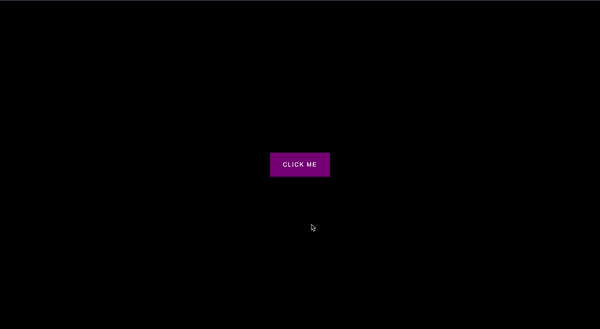

# 50 Projects in 50 Days - Button Ripple Effect

This is a code along project in the [50 Projects In 50 Days - HTML, CSS & JavaScript Udemy Course](https://www.udemy.com/course/50-projects-50-days/). Sharpen your skills by building 50 quick, unique & fun mini projects.

## Table of contents 😌

- [Overview](#overview)
  - [The project](#the-project)
  - [Screenshot](#screenshot)
  - [Links](#links)
- [My process](#my-process)
  - [Built with](#built-with)
  - [What I learned](#what-i-learned)
  - [Continued development](#continued-development)
  - [Code snippets](#im-really-proud-of-these-code-snippets%EF%B8%8F)
  - [Useful resources](#useful-resources)
- [Author](#author)
- [Acknowledgments](#acknowledgments)

## Overview👋🏾

Welcome to the 20<sup>th</sup> mini-project of the course!

### The project😥

In this project users will be able to:

- Build a responsive site that displays a button that ripples depending on where the user clicks.

### Screenshot🌇



### Links👩🏾‍💻

- Live Site URL: (https://glowing-choux-528879.netlify.app/)

## My process💭

This is a simple project that I started by marking out initial structure and classes, in HTML. Next I finalized the UI by styling the CSS. I styled the background as well as the button. I then added functionality by way of JavaScript to first get the position of the click, then using both the position of the click and the position of the button create the ripple animation.

### Built with👷🏾‍♀️

- Semantic HTML5 markup
- CSS custom properties
- Flexbox
- JavaScript

### What I learned👩🏾‍🏫

I learned the logic behind determining the position of events in the viewport. I will be applying this to future projects where needed.

I also learned how to use the @keyframes at-rule to create animations.

I learned that Event.target is always the object onto which the event was dispatched.

### Continued development🔮

In the future I plan on continuing to practice using event listeners to make my pages more functional.

I also plan on continuing to learn the best ways to phrase git commits, so that future viewers can fully understand the changes that have occurred.

### I'm really proud of these code snippets✂️

```css
button .circle {
  position: absolute;
  background-color: white;
  width: 100px;
  height: 100px;
  border-radius: 50%;
  transform: translate(-50%, -50%) scale(0);
  animation: scale 0.5s ease-out;
}

button:focus {
  outline: none;
}

@keyframes scale {
  to {
    transform: translate(-50%, -50%) scale(3);
    opacity: 0;
  }
}
```

```js
buttons.forEach(button => {
    button.addEventListener('click', function (e) {
        const x = e.clientX
        const y = e.clientY

        const buttonTop = e.target.offsetTop
        const buttonLeft = e.target.offsetLeft

        const xInside = x - buttonLeft
        const yInside = y - buttonTop

        const circle = document.createElement('span')
        circle.classList.add('circle')
        circle.style.top = yInside + 'px'
        circle.style.left = xInside + 'px'
        this.appendChild(circle)

        setTimeout(() => circle.remove(), 500);
    })
})

prev.addEventListener('click', () => {
  currentActive--;

  if (currentActive < 1) {
    currentActive = 1;
  }
  update();
});
```

### Useful resources📖

- [Resource 1](https://developer.mozilla.org/en-US/docs/Web/CSS/@keyframes) - This is an amazing article which details the @keyframes at-rule.
- [Resource 2](https://developer.mozilla.org/en-US/docs/Web/CSS/At-rule) - This is an  article which details the what at-rules do, as well as lists common ones.
- [Resource 3](https://developer.mozilla.org/en-US/docs/Web/API/Event/target) - This is an  article which defines target property of the Event interface.

## Author🔎

- Website - [Portfolio Site](https://maiannethornton.netlify.app/)
- Frontend Mentor - [@MaianneThornton](https://www.frontendmentor.io/profile/MaianneThornton)
- GitHub - [@MaianneThornton](GitHub.com/MaianneThornton)
- Twitter - [@MaianneThornton](https://twitter.com/MaianneThornton)
- LinkedIn - [@MaianneThornton](https://www.linkedin.com/in/maiannethornton/)

## Acknowledgments🙏🏾

Special Thanks go to [Brad Traversy](http://www.traversymedia.com/) and [Florin Pop](http://www.florin-pop.com/) creating the course and making reviewing concepts fun 😊.
